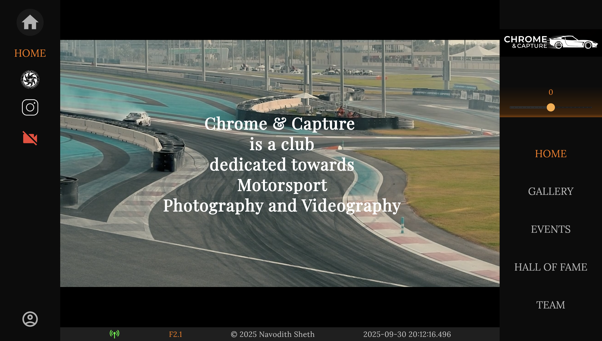
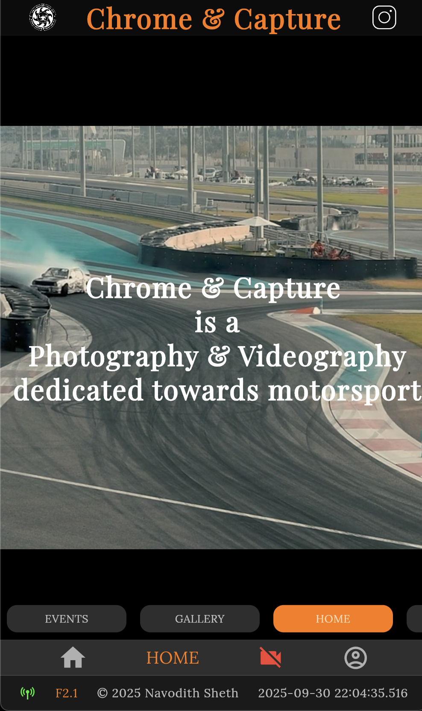
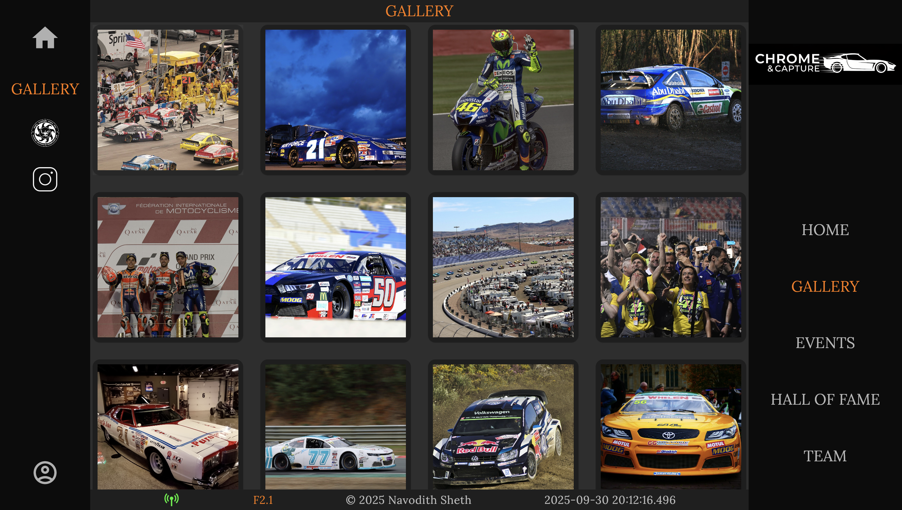
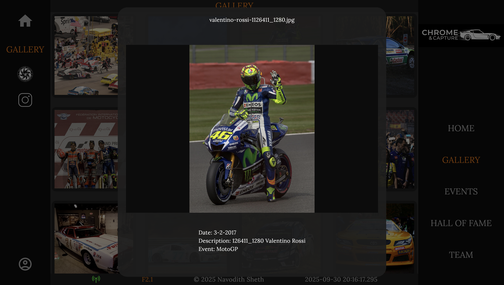
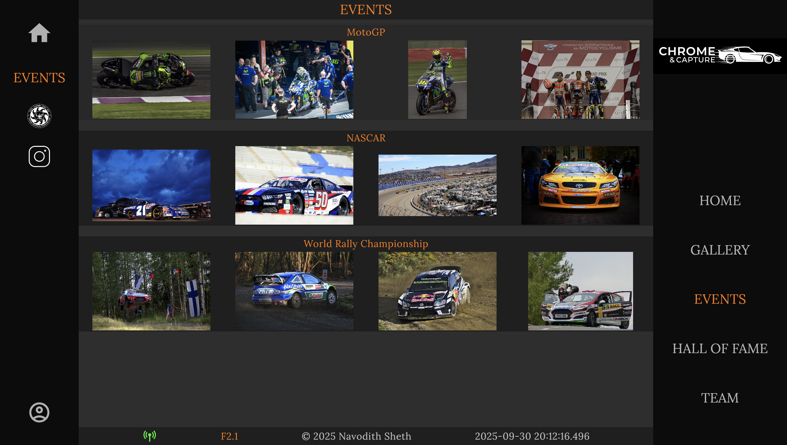
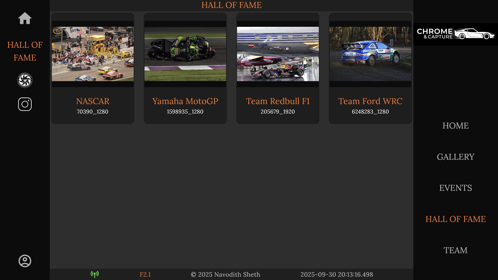
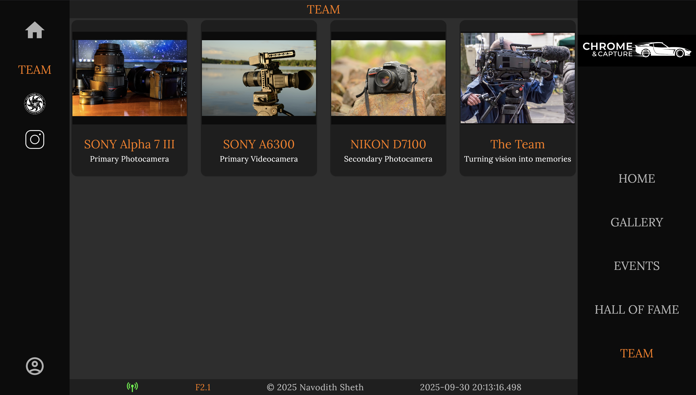
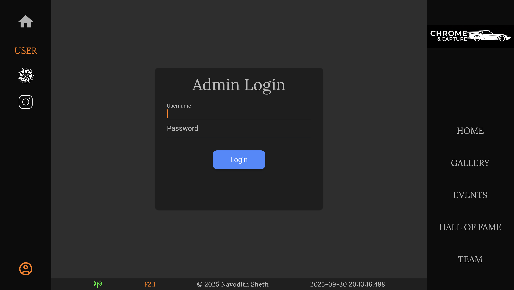
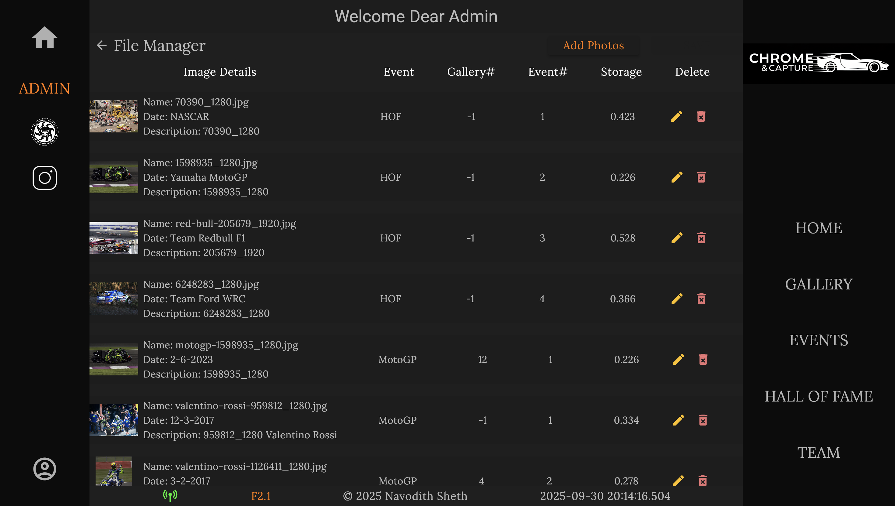
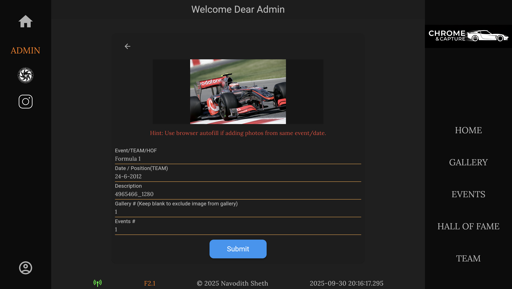

# Chrome & Capture

Chrome & Capture is a dynamic photography and videography club platform, designed with **Flutter Web** and powered by a **Cloudflare Workers backend**.  


- A key design principle behind this project is that the **UI mimics the look and feel of a camera interface**, giving photographers and videographers a familiar and professional experience.

- A key functional principle behind this project is that it is **responsive and dynamic**, ensuring the platform adapts seamlessly to any device while allowing content to be updated instantly for a consistently engaging experience.

## Live Demo  
[Visit the Website](https://chrome-and-capture.pages.dev/)


---

## Features

- Built with **Flutter Web** frontend and **Cloudflare Workers** backend
- **SQL Database** for structured metadata and event storage
- **R2 Object Storage** for scalable and reliable media hosting
- **RESTful API support** for seamless and dynamic data flow
- **Responsive Design**: separate UI flows for desktop, tablet, and mobile
- **Camera-Inspired UI**: a unique design aesthetic that resonates with photographers
- **Admin Authentication**: secure login for dynamic gallery and event management
- **Dynamic Content Management**: upload, edit, or delete images and assign them to galleries, events, or hall of fame instantly

---

## Functionality Overview

### Home Page  
The landing page introduces the club with strong visuals and a mission statement. The interface mimics a professional camera, creating an immediate sense of familiarity for photographers.

**Desktop:** 
  

**Mobile:**



---

### Gallery  
A modern, grid-based gallery displays all uploaded photos. Each image can be expanded to reveal metadata such as date, description, and associated event.

  


---

### Events  
Photos are organized into events (e.g., MotoGP, NASCAR, WRC), or any photography club event, making archives easy to browse.



---

### Hall of Fame  
A curated section to highlight special teams, iconic photographs, or milestone achievements.



---

### Team Page  
Introduce your club members and showcase the equipment used for capturing media. This page strengthens the identity of the club.



---

### Admin Authentication  
A secure login system for administrators ensures only authorized members can manage the platform.



---

### Admin Dashboard  
Administrators can upload, edit, categorize, and delete images dynamically. Media can be organized into galleries, assigned to events, or added to the hall of fame.

  

Add/Edit Photos:


---

## Technology Stack

- **Frontend:** Flutter Web (responsive UI,camera-inspired design)
- **Backend:** Cloudflare Workers
- **Database:** Cloudflare D1 (SQL)
- **Media Storage:** Cloudflare R2
- **API:** RESTful API endpoints (Wrangler)

---

## Use Cases

- Motorsport photography and videography clubs
- University photography societies
- Independent creative teams
- Any group that needs a **professional, photographer-friendly showcase platform**

---

## Development Setup

1. Clone the repository:
   ```bash
   git clone https://github.com/Ascrion/chrome-and-capture
   cd chrome-capture
   ```

2. Run the Flutter web app locally:
    ```
    flutter run -d chrome
    ```